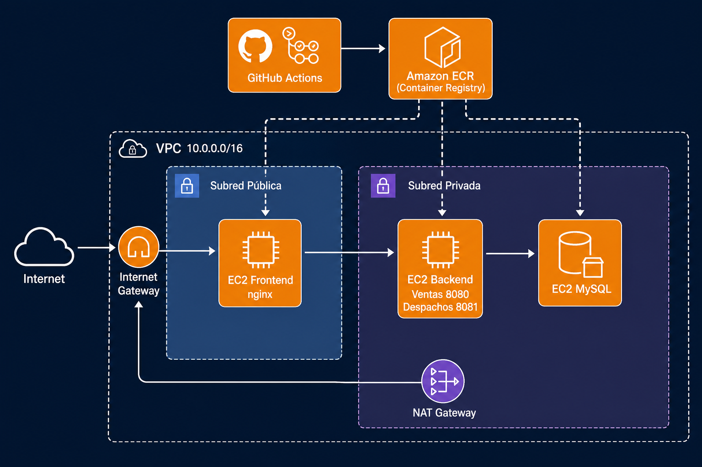
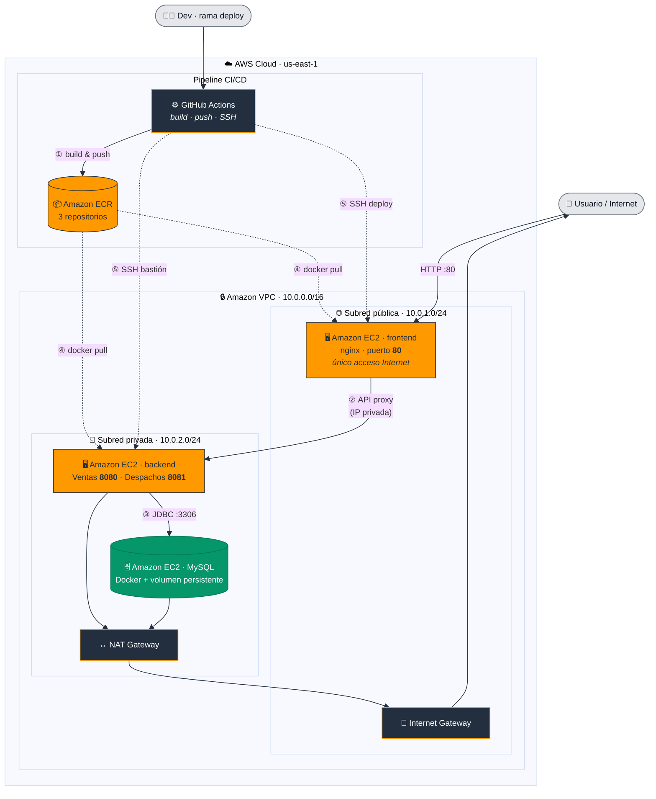

# Terraform AWS Infrastructure — Proyecto DevOps (EP2)

## Descripción

Infraestructura y aplicación gestionadas con **Terraform** y **Docker** para desplegar una arquitectura de microservicios en **AWS**, alineada con la evaluación EP2 (Innovatech Chile):

- **VPC** con subred **pública** y subred **privada**.
- **EC2 frontend** (React + nginx) como único punto de acceso desde Internet.
- **EC2 backend** (Spring Boot: ventas y despachos) en subred privada.
- **EC2 MySQL** con volumen Docker para persistencia de datos.
- **NAT Gateway** para que instancias privadas descarguen imágenes desde **ECR**.
- **Repositorios ECR** para las imágenes de contenedores.
- **GitHub Actions**: CI en `main`/`develop` y CD en rama `deploy`.

Solo el **frontend** es accesible desde Internet. El tráfico hacia los backends pasa por el proxy nginx del frontend, usando IPs privadas dentro de la VPC.

---

## Equipo

| Integrante | Rol principal | Contacto |
|------------|---------------|----------|
| Felipe Ardiles | Infraestructura AWS, Docker, CI/CD, Terraform | Repositorio principal |
| Renato Herrera | Desarrollo backend, apoyo en despliegue y documentación | idkraes17@gmail.com |

Los commits del proyecto EP2 incluyen coautoría de **Renato Herrera** (`Co-authored-by`) cuando corresponde a trabajo en pareja.

---

## Componentes de la aplicación

| Servicio | Tecnología | Despliegue |
|----------|------------|------------|
| Frontend | React + Vite + nginx (sin root) | EC2 pública — puerto 80 |
| Backend Ventas | Spring Boot (Java 17) | EC2 privada — puerto 8080 |
| Backend Despachos | Spring Boot (Java 17) | EC2 privada — puerto 8081 |
| MySQL 8 | Docker + volumen `mysql_data` | EC2 privada — puerto 3306 |

---

## Estructura del proyecto

```text
proyecto-semestral/
├── .github/workflows/
│   ├── ci.yml                    # Build de imágenes (main, develop)
│   └── cd.yml                    # Build + ECR + deploy EC2 (deploy)
├── back-Ventas_SpringBoot/
│   └── Springboot-API-REST/      # API ventas + Dockerfile
├── back-Despachos_SpringBoot/
│   └── Springboot-API-REST-DESPACHO/
├── front_despacho/               # Frontend + Dockerfile + nginx template
├── infra/
│   ├── etapa_1/                  # Registro ECR (3 repositorios)
│   │   ├── main.tf
│   │   ├── variables.tf
│   │   └── outputs.tf
│   └── etapa_2/                  # VPC, EC2, SG, NAT
│       ├── main.tf
│       ├── variables.tf
│       ├── outputs.tf
│       └── templates/            # user_data (docker compose en EC2)
│           ├── mysql_user_data.sh
│           ├── backend_user_data.sh
│           └── frontend_user_data.sh
├── scripts/                      # Opcional: automatización local
│   ├── deploy-evaluacion.sh
│   └── deploy.env.example
├── docker-compose.yml            # Entorno local
├── .env.example
└── README.md
```

---

## Requisitos

| Herramienta | Versión / nota |
|-------------|----------------|
| **Terraform CLI** | >= 1.0 |
| **AWS CLI** (`aws`) | Credenciales del **AWS Academy Learner Lab** |
| **Docker** | Para build local y push a ECR |
| **Git** | Control de versiones |
| **Provider AWS** | `hashicorp/aws` ~> 5.0 |
| **Key pair** | `vockey` (Download PEM del lab → `~/.ssh/vockey.pem`) |

Permisos necesarios en la cuenta del lab: creación de VPC, EC2, ECR, IAM (rol `LabRole`).

---

## Flujo de uso

### 1. Clona el repositorio

```bash
git clone https://github.com/FelipeArdiles/devops-ev2.git
cd devops-ev2
```

### 2. Configura credenciales AWS

```bash
aws configure
# O exporta AWS_ACCESS_KEY_ID, AWS_SECRET_ACCESS_KEY y AWS_SESSION_TOKEN del panel del lab
aws sts get-caller-identity
```

### 3. Inicializa y despliega la infraestructura (Terraform)

**Etapa 1 — ECR:**

```bash
cd infra/etapa_1
terraform init
terraform plan
terraform apply
```

**Etapa 2 — VPC + EC2:**

```bash
cd ../etapa_2
terraform init
terraform plan \
  -var="db_password=root" \
  -var="db_name=proyecto_db" \
  -var="key_pair_name=vockey"
terraform apply \
  -var="db_password=root" \
  -var="db_name=proyecto_db" \
  -var="key_pair_name=vockey"
```

### 4. Obtén las IPs de salida

```bash
terraform output frontend_public_ip      # URL pública de la app
terraform output backend_private_ip    # Para secrets / proxy interno
terraform output frontend_url
```

### 5. Build y push de imágenes a ECR

```bash
aws ecr get-login-password --region us-east-1 | \
  docker login --username AWS --password-stdin <ACCOUNT_ID>.dkr.ecr.us-east-1.amazonaws.com

# Build y push (ejemplo backend ventas)
docker build --platform linux/amd64 \
  -t <ACCOUNT_ID>.dkr.ecr.us-east-1.amazonaws.com/devops-u2-backend-ventas:latest \
  ./back-Ventas_SpringBoot/Springboot-API-REST
docker push <ACCOUNT_ID>.dkr.ecr.us-east-1.amazonaws.com/devops-u2-backend-ventas:latest
# Repetir para backend-despachos y frontend
```

### 6. Despliegue en las EC2 (SSH)

En cada instancia existe `/opt/app/deploy.sh` (creado por `user_data`). Desde tu máquina:

```bash
# Backend (vía bastión — frontend)
ssh -i ~/.ssh/vockey.pem \
  -o ProxyCommand="ssh -i ~/.ssh/vockey.pem -W %h:%p ec2-user@<IP_FRONTEND>" \
  ec2-user@<IP_BACKEND_PRIVADA> 'sudo /opt/app/deploy.sh'

# Frontend (actualizar IP del backend en .env antes del deploy)
ssh -i ~/.ssh/vockey.pem ec2-user@<IP_FRONTEND> \
  'sudo sed -i "s/^BACKEND_HOST=.*/BACKEND_HOST=<IP_BACKEND_PRIVADA>/" /opt/app/.env && \
   sudo sed -i "s/^BACKEND_HOST_DESPACHOS=.*/BACKEND_HOST_DESPACHOS=<IP_BACKEND_PRIVADA>/" /opt/app/.env && \
   sudo /opt/app/deploy.sh'
```

**Alternativa (script opcional):**

```bash
cp scripts/deploy.env.example scripts/deploy.env
chmod +x scripts/deploy-evaluacion.sh
./scripts/deploy-evaluacion.sh deploy    # Todo el flujo
./scripts/deploy-evaluacion.sh redeploy  # Solo SSH (imágenes ya en ECR)
./scripts/deploy-evaluacion.sh destroy   # Destruir infra AWS
```

### 7. Desarrollo local (sin AWS)

```bash
cp .env.example .env
docker compose up --build
```

| Servicio | URL local |
|----------|-----------|
| Frontend | http://localhost:3000 |
| API Ventas | http://localhost:8080 |
| API Despachos | http://localhost:8081 |

---

## ¿Qué despliega este proyecto?

### Etapa 1 — `infra/etapa_1` (registro de imágenes)

Crea tres repositorios en **Amazon ECR**:

- `devops-u2-backend-ventas`
- `devops-u2-backend-despachos`
- `devops-u2-frontend`

### Etapa 2 — `infra/etapa_2` (red y cómputo)

| Recurso | Descripción |
|---------|-------------|
| **VPC** `10.0.0.0/16` | Red virtual del proyecto |
| **Subred pública** `10.0.1.0/24` | EC2 frontend + Internet Gateway |
| **Subred privada** `10.0.2.0/24` | EC2 backend + EC2 MySQL |
| **NAT Gateway** | Salida a Internet para subred privada (pull ECR) |
| **Security Groups** | Solo puerto 80/22 públicos en frontend; backends solo desde frontend |
| **EC2 frontend** | Contenedor nginx + React (proxy a backend privado) |
| **EC2 backend** | Contenedores Spring Boot (8080, 8081) |
| **EC2 MySQL** | Contenedor MySQL con volumen persistente |

Los `outputs` de Terraform exponen IPs, URLs y URLs de ECR para integrar con CI/CD.

### Aplicación y CI/CD

- **Dockerfiles** multi-stage y ejecución con **usuario no root**.
- **`docker-compose.yml`** local con red `app-network` y volumen MySQL.
- **`ci.yml`**: valida build en push a `main` / `develop`.
- **`cd.yml`**: en push a `deploy` → build, push ECR, deploy SSH a EC2.

---

## Flujo de ramas (Git)

| Rama | Uso | Workflow |
|------|-----|----------|
| `main` / `develop` | Desarrollo e integración | `ci.yml` — solo build |
| `deploy` | Producción en AWS | `cd.yml` — build + ECR + deploy |

```bash
git checkout deploy
git merge main
git push origin deploy
```

### Secrets de GitHub Actions

Configurar en **Settings → Secrets and variables → Actions**:

| Secret | Descripción |
|--------|-------------|
| `AWS_ACCESS_KEY_ID` | Del Learner Lab |
| `AWS_SECRET_ACCESS_KEY` | Del lab |
| `AWS_SESSION_TOKEN` | Del lab (sesiones temporales) |
| `AWS_ACCOUNT_ID` | ID de cuenta AWS |
| `EC2_SSH_PRIVATE_KEY` | Contenido completo de `~/.ssh/vockey.pem` |
| `EC2_FRONTEND_HOST` | `terraform output frontend_public_ip` |
| `EC2_BACKEND_PRIVATE_IP` | `terraform output backend_private_ip` |

> Tras cada `terraform apply` que cambie IPs, actualiza los secrets `EC2_*`.

---

## Diagrama de arquitectura

### Vista general (estilo AWS)



> Iconografía inspirada en [AWS Architecture Icons](https://aws.amazon.com/architecture/icons/).  
> Colores de referencia: naranja AWS `#FF9900`, fondo oscuro `#232F3E`.

### Vista interactiva (Mermaid)

Leyenda: **azul** = subred pública · **violeta** = subred privada · **naranja** = servicios AWS/compute · **gris oscuro** = red y CI/CD



#### Flujo resumido

| Paso | Qué ocurre |
|------|------------|
| ① | GitHub Actions construye imágenes y las sube a **ECR** |
| ② | El **frontend** (público) enruta `/api/*` al **backend** por red privada |
| ③ | Los backends persisten datos en **MySQL** (volumen Docker) |
| ④ | Las EC2 privadas descargan imágenes desde ECR vía **NAT** |
| ⑤ | El pipeline despliega en EC2 por **SSH** (frontend como bastión al backend) |

---

## Mejores prácticas incluidas

- **Variables** centralizadas en `infra/etapa_2/variables.tf` y parámetros en `apply`.
- **Outputs** para IPs, URL del frontend y registros ECR.
- **Separación por etapas**: etapa_1 (ECR) y etapa_2 (red + cómputo).
- **Plantillas `user_data`** para bootstrap reproducible en cada EC2.
- **Security groups** con principio de mínimo privilegio (solo frontend expuesto).
- **Contenedores** con multi-stage build y usuario no root.
- **`.gitignore`** para `.env`, `*.pem` y `terraform.tfstate`.
- **CI/CD** con ramas diferenciadas (`main` vs `deploy`).

---

## Cómo extender este proyecto

- Añadir **Application Load Balancer** delante del frontend.
- Incorporar **RDS** en lugar de MySQL en EC2.
- Migrar estado de Terraform a **backend remoto** (S3 + DynamoDB lock).
- Añadir **CloudWatch** alarms y logs centralizados.
- Integrar **Terraform Cloud** o validación con `terraform fmt` / `tflint` en CI.
- Automatizar rotación de secrets con **AWS Secrets Manager**.

---

## Cumplimiento EP2 (referencia rápida)

- Multi-stage Dockerfiles y usuario no root.
- `docker-compose` local con redes y volúmenes.
- Frontend en EC2 pública; backends y MySQL en subred privada.
- Persistencia MySQL con volumen Docker.
- Pipeline: build → ECR → despliegue en EC2 (rama `deploy`).
- Solo el frontend accesible desde Internet.
